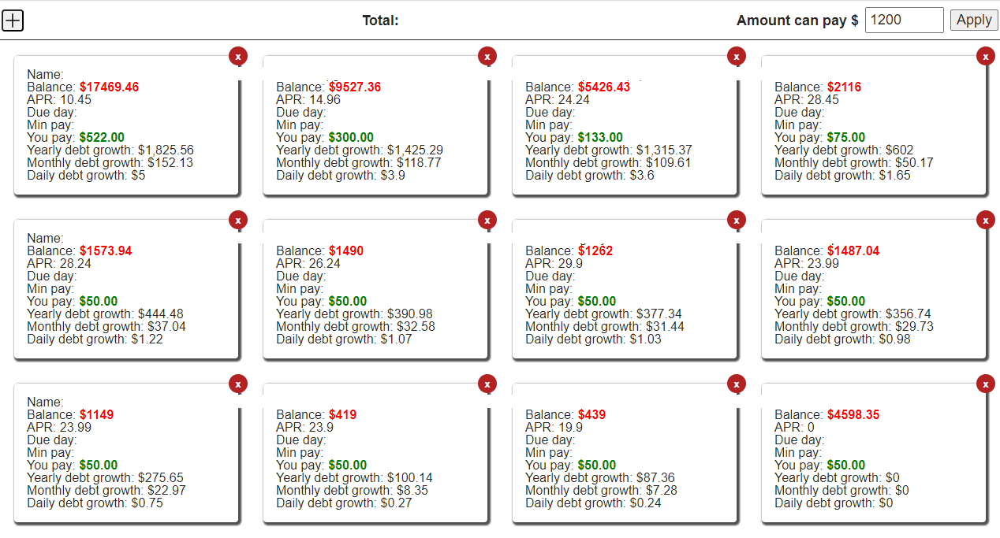

### About

This is a basic debt payoff prioritizer app which is based on the APR/balance.

### Live app
[View GitHub Pages app](https://jdc-cunningham.github.io/debt-payment-prioritizer/)

### Bugs
* one weird one, after you enter data, need to refresh for the amount to work, otherwise the min $50 per card multiplication doesn't work correctly.
### Disclaimer
This app has no authentication and stores your data in plaintext on your computer (`localStorage`).

### Features
- [ ] add ability to mark as paid (all local state so just add prop to obj)

### Icons from UXWing